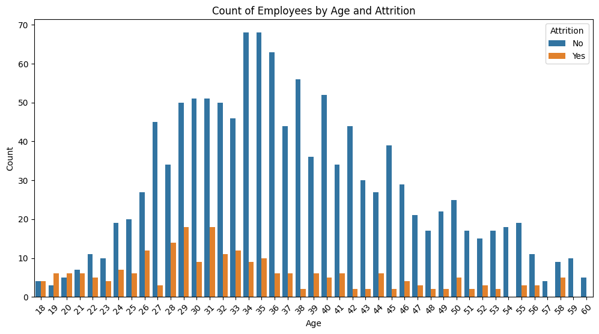
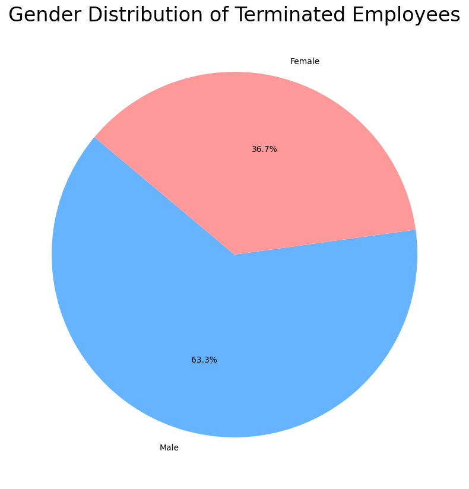
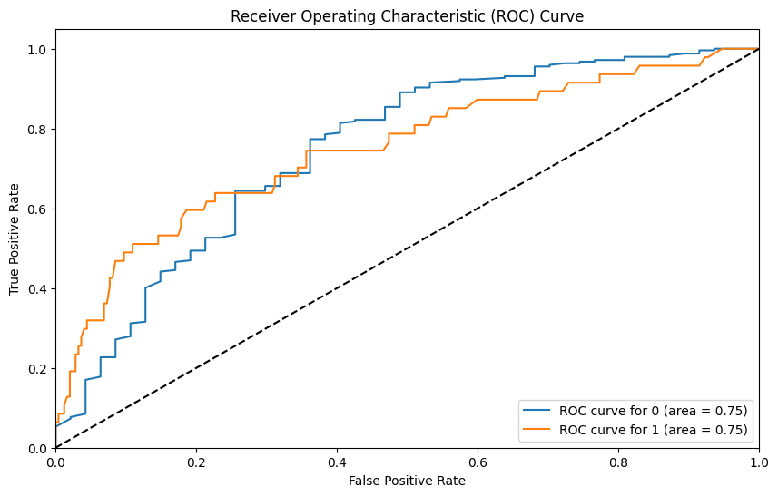
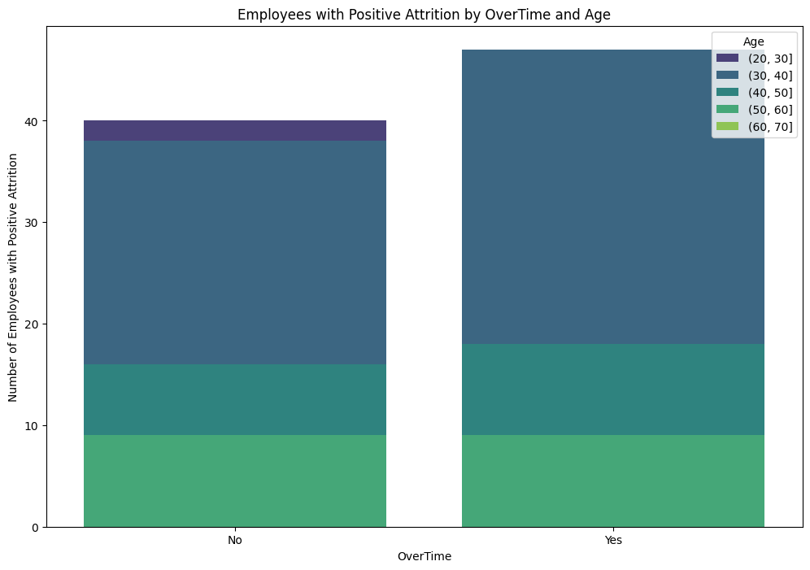
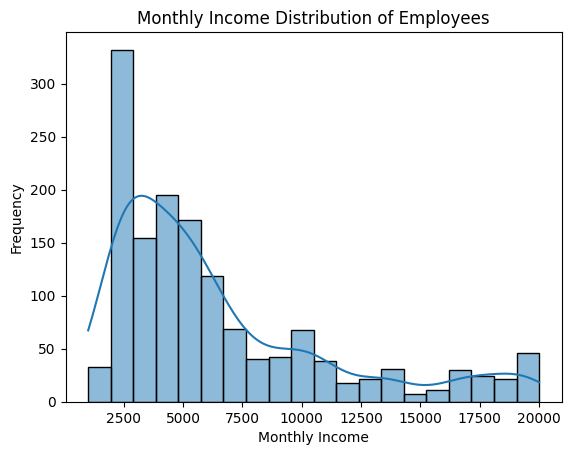

# HR_Analytics  

### Will Byrd  
### Flatiron School 2024  

## Introduction  

In this notebook, we will take a look at an HR Analytics dataset and perform a binary classification to determine Attrition. Attrition is the departure of an employee from an organization fro any reason. In this dataset we do not have context on why the emlpoyee leaves the company-they may have been fired or they may have resigned.  

## Business Understanding  
For companies and orgnizations-the employees are the most important asset.  Therefore, it is vitally important to be able to predict behavior of these employees.  Knowing which employees will stay with the company can:  

* Reduce turnover costs  
  * Hiring and firing employees is expensive  
* Increase employee engagement and morale  
  * It can be difficult to maintain strong company culture if turnover is high  
* Assist with resource planning  
  * Companies can add resources to employees they believe will contribute to longterm growth
  * Conversely, companies can take proactive measures to retain at risk employees
* Improve customer relationships  
  * Customer percieve companies that retain talent more positively
* Enhance company reputation  
  * Company brand is often times tied to the employees interacting with the customers  
 
### Goal 
The main goal of our model is to maximize **accuracy**.  Accuracy will be important here as being able to accurately predict which employees will stay and which will leave is important.  It's also important to understand that since we don't know if employees are fired and which ones quit, simply targeting the positive Attrition class (Recall) will still not tell the entire story.  

Here are the metrics we will be looking at for this business case:  

* Accuracy-Overall accuracy of our model  

* Precision-Accuracy of positive predictions made by our model  
  * High Precision indicates that an employee will leave, it is usually correct.  **High Precision minimizes false positives.**    

* Recall-The ability of our model to identify the actual positive observations  
  * High Recall is going to be tough with this dataset specifically since we are battling a class imbalance issue.  As we will see in our dataset, nearly 15% of our data is the positive **Attrition** class.  
  
* F1-Score that factors in both Precision and Recall
  
## EDA  
HR Analytics data was collected [here](https://www.kaggle.com/datasets/pavansubhasht/ibm-hr-analytics-attrition-dataset?select=WA_Fn-UseC_-HR-Employee-Attrition.csv).  This is a 228 kB, publicly available csv file with 1479 rows and 35 columns from Kaggle.  Important features are going to be our target value **'Attrition'**, and various features such as:  

* Job Satisfaction
* Age
* Sex
* Job Title
* Salary  
* Overtime 

### Data Preperation  

This dataset is already cleaned, but some processing still needs to occur.  We will need to:  

* Engineer Features  
  * Combining, Transforming columns
  * Label Encoding, One-Hot Encoding categorical features
* Dropping Columns  
* Balancing Classes  
  * The class imblance issue will be a limitation of this dataset and a tradeoff between overall accuracy and Recall will happen  
  
## Modeling

We will end up building 20 models! Here is a quick synopsis of our methodology:

baseline model
baseline model addressing class imbalance
Baseline model addressing class imbalance with GridSearchCV performed to optimize hyperparameters
model with unimportant features dropped
model with unimportant features dropped addressing class imbalance
model with unimportant features dropped addressing class imbalance with GridSearchCV performed to optimize hyperparameters  

This methodology will be applied to all 3 types of models we are building:

Decision Tree
Random Forest
K-Nearest Neighbors  

Then we will read in all results and pick the 4 best models. Those 4 best models will be used to create a Stacking Ensemble and then a Stacking Ensemble with GridSearchCV to finetune hyperparameters. Once our best model is created, we can discuss results.  

## Conclusion 

* **Balancing our data raised the Recall and lowered the accuracy and precision** for our almost all of our models.
* When comparing respective base models (df, df_fi), retraining the model on data from **df_fi had a positive or nuetral impact on all scores except Precision.**
* Our **finetuned Voting model is our best model.**  It has the highest F1-Score and ROC_AUC while also making the best trade-off for Accuracy to improve Recall and Precision.

### Recommendations  
The features with some of the biggest impact on our model are 'Overtime', 'Age', 'TotalWorkingYears', 'WorkLifeBalance', and 'MonthlyIncome'.  Based on our EDA earlier, we know that the distribution of employee age is skewed to the right, meaning most employees are going be earlier in their career and some of them are going to be older executives.  More holistically, the feature importances tell us that a shift in company culture is needed.    

Most employees who leave the company seem to be younger employees. Based on [this](https://www.gallup.com/workplace/610856/new-challenge-engaging-younger-workers.aspx) article from Gallup this is a growing trend.  According to that article, Millenials and Gen Z are having a hard time staying engaged at work.  These feelings are accompanied with burnout, feeling overworked, less work-life balance, and not feeling fairly compensated.  All of this is evident in our data as well.  

### Next Steps  

Our class imbalance issue is the biggest limitation to this analysis.  Our models and iterative approach yielded strong results.  However, to truly optimize analysis here, we would need a more robust dataset.  Gathering HR data can always be tricky, but if this was combined with US Census data and all features were standardized, this modeling approach could provide some great insights.  

Other features could have improved the results or given more context.  For example, if we had information on spousal income or state residence we could better understand the importance of these jobs to people.  If someone lives in a more expensive state and contributes to the majority of their families income, they may be less inclined to leave a job in which they are unhappy, overworked, burned-out, etc. 

Lastly, we don't know the reason these employees left their jobs.  We still don't know if they were fired or let go.  This would drastically change the context of results as well.